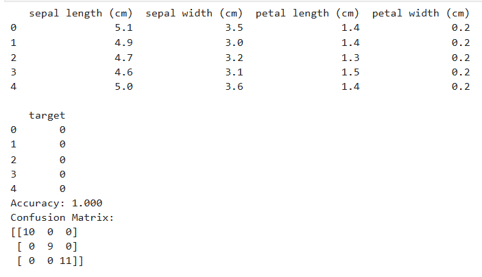
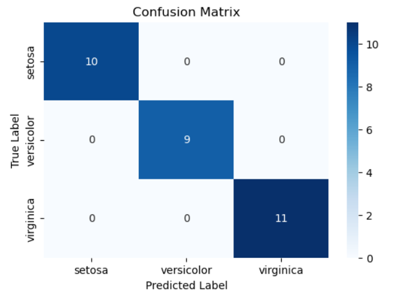

# SGD-Classifier
## AIM:
To write a program to predict the type of species of the Iris flower using the SGD Classifier.

## Equipments Required:
1. Hardware – PCs
2. Anaconda – Python 3.7 Installation / Jupyter notebook

## Algorithm

1. Parameters: Set initial weights (theta) to zero.
2. Compute Predictions: Calculate predictions using the sigmoid function on the weighted inputs.
3. Calculate Cost: Compute the cost using the cross-entropy loss function.
4. Update Weights: Adjust weights by subtracting the gradient of the cost with respect to each weight.
5. Repeat: Repeat steps 2–4 for a set number of iterations or until convergence is achieved. 

## Program:

## Developed by: HEMALISHA T
## RegisterNumber: 212225040123

```
import pandas as pd
from sklearn.datasets import load_iris
from sklearn.model_selection import train_test_split
from sklearn.linear_model import SGDClassifier
from sklearn.metrics import accuracy_score, confusion_matrix
import matplotlib.pyplot as plt

iris = load_iris()

X = iris.data

y = iris.target

X_train, X_test, y_train, y_test = train_test_split(
    X, y, test_size=0.2, random_state=42
)

model = SGDClassifier()

model.fit(X_train, y_train)

y_pred = model.predict(X_test)

print("Accuracy:", accuracy_score(y_test, y_pred))

print("Confusion Matrix:")
print(confusion_matrix(y_test, y_pred))

new_flower = [[5.1, 3.5, 1.4, 0.2]]

prediction = model.predict(new_flower)

print("Predicted Species:", iris.target_names[prediction][0])

plt.scatter(X[:,0], X[:,1], c=y)

plt.xlabel("Sepal Length")
plt.ylabel("Sepal Width")
plt.title("Iris Flower Classification")

plt.show()
```

## Output:





## Result:
Thus, the program to implement the prediction of the Iris species using SGD Classifier is written and verified using Python programming.
